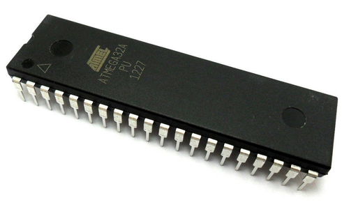

# Getting Started with AVR Programming
Atmega is one of the most widely used series of microcontrollers in the industry as well as the hobby world - mainly because of the versatile functionality of these devices, as well as a huge open source community. Getting started with AVR microcontrollers can be a little confusing for people new to this world, so in this repository I will try to give a brief overview of the internal working principle of microcontrollers, as well as AVR programming on a **Windows Machine**. Aside from the software interfaces, coding scheme for microcontrollers should be identical regardless of the operating system (Windows/OSx/Linux) being used.

## Table of Contents

- [Overview](#microcontroller-overview)
- [Software](#required-software)
- [Hardware](#required-hardware)
- [Getting Started](#getting-started)
- [Microcontroller Basics](#microcontroller-basics)
- [References](#references)

# Microcontroller Overview

# Required Software

Different microcontrollers use different programming softwares and development environments. If you have used arduino, you are already familiar with Arduino IDE. Arduino itself is a development board based on AVR microcontrollers, and thus it has some of the AVR libraries working in the backbone. For general AVR programming, we will be using the following softwares:

- <a href="https://www.microchip.com/mplab/avr-support/atmel-studio-7">**Atmel Studio**</a> : Studio 7 is the integrated development platform (IDP) for developing and debugging all AVR® and SAM microcontroller applications. The Atmel Studio 7 IDP gives you a seamless and easy-to-use environment to write, build and debug your applications written in C/C++ or assembly code.
<figure align="center">
    
    <figcaption>Atmel Studio 7 start page</figcaption>
</figure>

- <a href="https://avrdudess.software.informer.com/2.8/">**AVRDUDESS**</a> : The software responsible for burning codes compiled from Atmel Studio to the microcontroller hardware. <a href="https://extreme-burner-avr.software.informer.com/">Extreme Burner</a> is a suitable alternative (although the repository uses the former software)
<figure align="center">
    
    <figcaption>avrdudess gui</figcaption>
</figure>

- <a href="https://sourceforge.net/projects/winavr/">**WINAVR**</a> : A suite of executable, open source software development tools for the Atmel AVR series of RISC microprocessors hosted on the Windows platform. Includes the GNU GCC compiler for C and C++. 

# Required Hardware

There are two key hardware components for getting started with AVR programming. 

- **AVR Microcontroller**: Here is a <a href="https://www.microchip.com/design-centers/8-bit/avr-mcus">list of AVR microcontrollers</a> available, however one of the most widely used models are <a href="https://www.microchip.com/wwwproducts/en/ATmega328p">ATmega328p</a> (used in <a href="https://store.arduino.cc/usa/arduino-uno-rev3">Arduino Uno</a>) and <a href="https://www.microchip.com/wwwproducts/en/ATmega32A">ATmega32A</a>. Either microcontroller would be suitable for following this repository.
<figure align="center">
    
    <figcaption>ATmega32A Microcontroller</figcaption>
</figure>

- **Programmer**: Several types of programmers are available. We would be using <a href="https://www.amazon.com/USBasp-Programming-Quadcopter-Atomic-Market/dp/B00V42E8JC">USBasp programmer</a>. You can also use a dedicated <a href="https://www.techshopbd.com/product-categories/avr-98776/1057/avr-mini-development-kit-techshop-bangladesh">AVR development board</a> for easily uploading codes to your microcontroller and testing them.
<figure align="center">
    
    <figcaption>USBasp Programmer</figcaption>
</figure>
<figure align="center">
    
    <figcaption>AVR Development Board</figcaption>
</figure>

# Getting Started

## Setting up USBasp Programmer

- Download the <a href="http://www.mediafire.com/file/z576zrku371qyjs/windows-8-and-windows-10-usbasp-drivers-libusb_1.2.4.0-x86-and-x64-bit.zip">USBASP driver</a>. Now there is a slight issue when installing the USBASP driver on windows 8 or windows 10, which can be solved via <a href="usbasp.md">**these steps here**</a>

## First Code on Atmel Studio

## Uploading Code to Microcontroller

# Microcontroller Basics

# References
