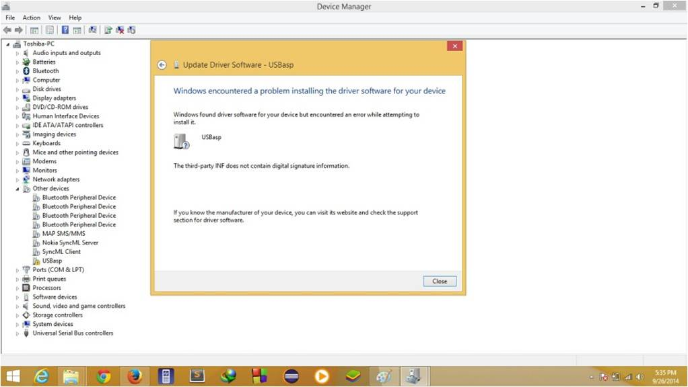

## Disabling Digital Driver Signature on Windows 10

- USBasp will not work with windows 10 and windows 8 as there is a complication with digital signature, only digitally signed drivers are allowed in windows 8 and windows 10. When you will try to install usb asp in windows 10  and windows you will get error message like this one
<figure align="center">
    
    <figcaption>Error Message</figcaption>
</figure>

- Therefore we have to disable the signature checking in windows 8 and windows 10. **Now Hold Shift key and restart your computer by clicking on restart button** . There will be a bunch of options available now, Click **Troubleshoot**
<figure align="center">
    
    <figcaption>Restart Options</figcaption>
</figure>

- In the next screen, click **Advanced Options**
<figure align="center">
    
    <figcaption>Troubleshoot Options</figcaption>
</figure>

- Click on **Startup Settings**
<figure align="center">
    
    <figcaption>Advanced Options</figcaption>
</figure>

- Click **Restart**
<figure align="center">
    
    <figcaption>Startup Settings</figcaption>
</figure>

- After system restarts, the following screen will show up. Press **7** on keyboad. Now after the system starts up, you should be able to install USBasp 
<figure align="center">
    
    <figcaption>Startup Settings</figcaption>
</figure>